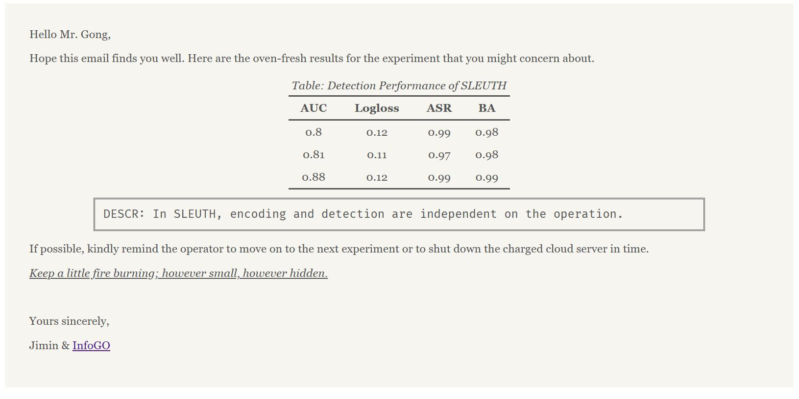

# InfoGO: Information, GO GO GO! 

> time-lead scenario

## Installation

**InfoGO** is built on *Python 3.8* and makes use of several modules including `smtplib` for sending emails, `dominate` for editing HTML emails, and `pyaml` for config management.

Run the command to install all dependent packages:

```bash
conda create --name <env> --file requirements.txt
```

## Usage

- Set the config of **InfoGO** in [config.yaml](infogo/config.yaml). 

  - Sender

  ```yaml
  sender:
    name: Anonymous
    address: XXXXXXXXXXX@qq.com
    smtp_server: smtp.qq.com
    authorization_code: XXXXXXXXXXXXXXXX
  ```

  > In order to send emails using a script, an authorization code must be obtained. For instance, QQ Mail provides [this service](https://service.mail.qq.com/detail/0/75).

  - Receivers

  ```yaml
  receivers:
    - name: Alice
      address: XXXX@XX
  
    - name: Bob
      address: XXXX@XX
  ```

  

- Fed the results into **InfoGO** app.

  ```python
  from infogo import InfoGO
  
  infogo = InfoGO()	# create an InfoGO app
  infogo.fed(
      title="Detection Performance of SLEUTH",	# title of the experiment
      head=["AUC", "Logloss", "ASR", "BA"],	# experimental items, usually some metrics 
      content=[	# corresponding results
          [0.80, 0.12, 0.99, 0.98],
          [0.81, 0.11, 0.97, 0.98],
          [0.88, 0.12, 0.99, 0.99]
      ],
      description="In SLEUTH, encoding and detection are independent on the operation.", # explanation for the experiment results
      signature="Jimin"	# signature of the notification, or default as the sender's name
  )
  ```
  
  An illustration for the experiment table:


- Deliver the email.

  ```python
  infogo.deliver()
  ```

  

## Stinger
