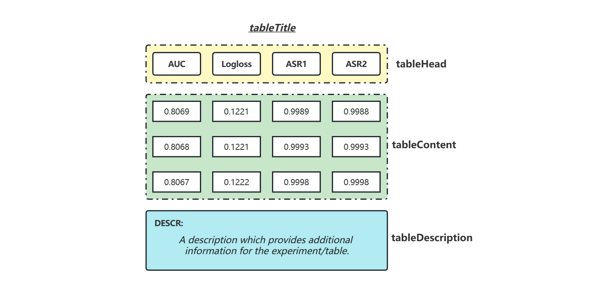

# InfoGO: Information, GO GO GO! 

> you

## Installation

Most importantly,  this repo applies  `smtplib` to send emails, adopts `dominate` to edit the HTML email, and uses `pyaml` to manage the config.

Run the command to install all dependent packages:

```bash
conda create --name <env> --file requirements.txt
```

 

## Usage

- Set the config of **InfoGO** in `config.yaml`

  - Sender

  ```yaml
  sender:
    name: Anonymous
    address: XXXXXXXXXXX@qq.com
    smtp_server: smtp.qq.com
    authorization_code: XXXXXXXXXXXXXXXX
  ```

  - Receivers

  ```yaml
  receivers:
    - name: Alice
      address: XXXX@XX
  
    - name: Bob
      address: XXXX@XX
  ```

  

- Fed the results into **InfoGO** app



## Stinger
